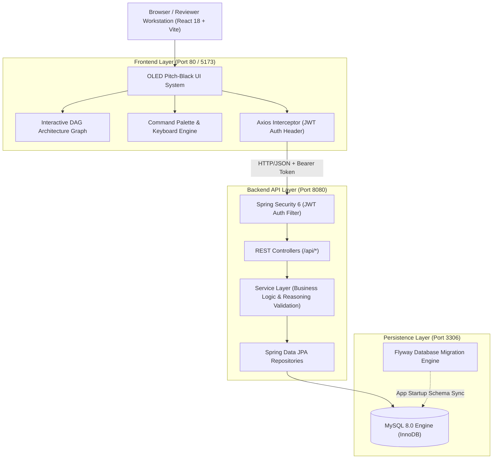
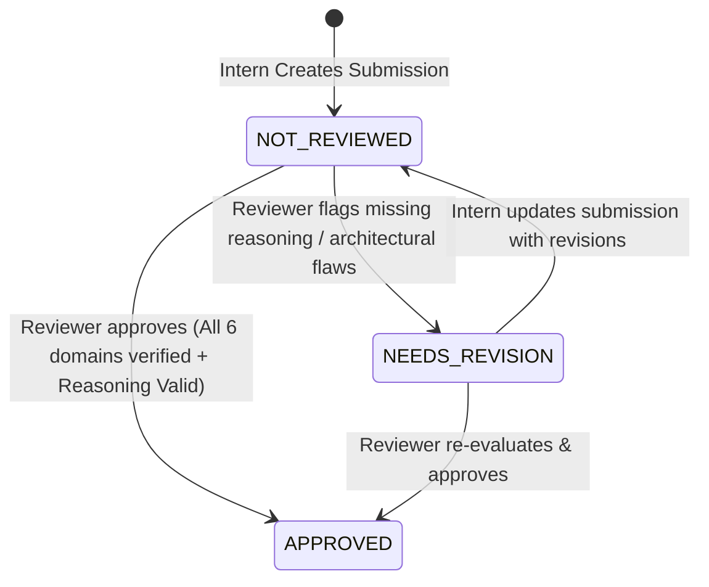
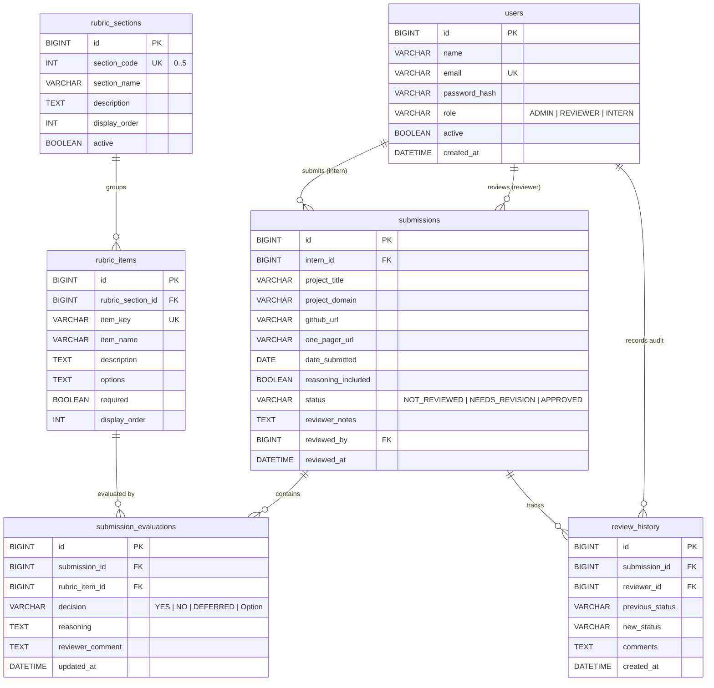
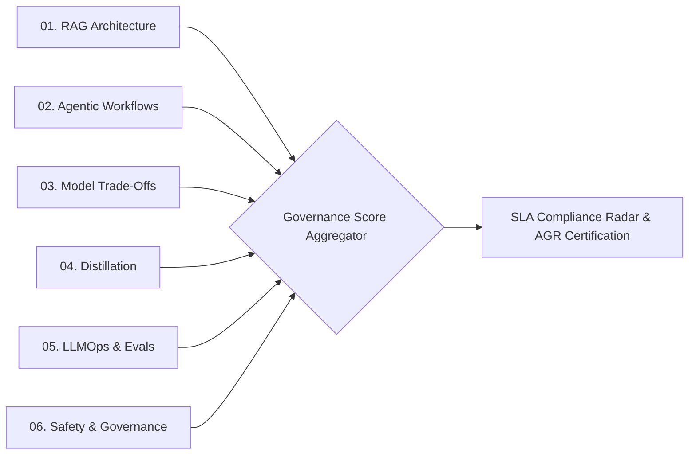
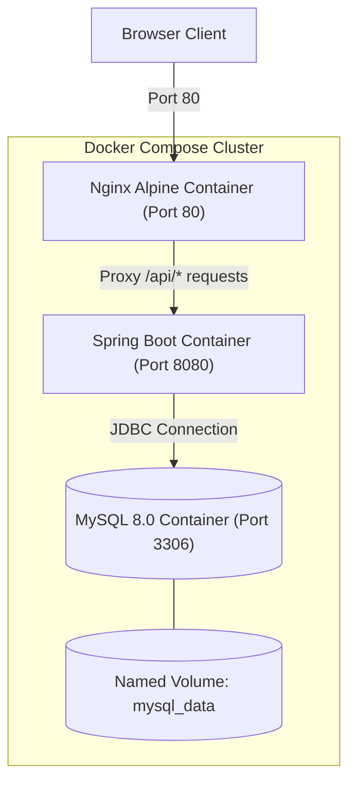

# 🏛️ ARCHON System Design & Architecture Specification

> **AI Architecture Review & Governance Network**  
> *Decide. Justify. Review. Audit. Govern.*

---

## 1. Executive Summary & Vision

**ARCHON** is an enterprise-grade governance and evaluation platform engineered specifically for reviewing, validating, auditing, and benchmarking **Generative AI / Large Language Model (LLM)** architectures. 

Traditional capstone review workflows rely on ad-hoc spreadsheets or disconnected documents, resulting in lost architectural justifications, inconsistent scoring, and zero governance auditability. ARCHON standardizes the evaluation lifecycle through:
1. **Compulsory Architectural Reasoning Enforcement (ADR pattern)** across 6 AI domains.
2. **Normalized Relational Data Model** with Flyway migration versioning.
3. **Role-Based Access Control (RBAC)** securing administrative, reviewer, and intern operations.
4. **OLED Pitch-Black Review Workstation** featuring interactive DAG architecture graph visualization, criterion-linked AI intelligence, and immutable audit logging.
5. **Automated Enterprise Export Engine** producing standardized Architectural Governance Records (AGR).

---

## 2. High-Level System Architecture

ARCHON adopts a decoupled client-server architecture deployed via multi-stage Docker containers or native local runtimes.



---

## 3. Core Business Rules & Invariants

### 3.1 Architectural Reasoning Enforcement
> **"Every architecture decision requires a reason."**

Merely selecting a technology stack item (e.g., choosing *Qdrant* for Vector Storage or *vLLM* for Serving) is insufficient for evaluation. ARCHON enforces compulsory decision-plus-reasoning validation:
- When filling evaluation criteria, the reviewer/submitter must supply both `decision` and `reasoning`.
- If `reasoning.trim().length <= 5`, the system sets `reasoning_included = false` and flags the record with `⚠ ARCHITECTURAL REASONING REQUIRED`.
- A submission cannot transition to `APPROVED` if compulsory reasoning is incomplete.

### 3.2 State Machine & Submission Lifecycle
Submissions follow a strict transition lifecycle tracked in the immutable `review_history` audit ledger:



### 3.3 Role-Based Access Control (RBAC) Matrix

| Permission / Action | `ADMIN` | `REVIEWER` | `INTERN` |
|---|:---:|:---:|:---:|
| **View Command Center & Analytics** | ✅ | ✅ | ✅ |
| **Create New Submission** | ✅ | ❌ | ✅ |
| **Edit Own Draft Submission** | ✅ | ❌ | ✅ |
| **Submit Rubric Decisions & Reasoning** | ✅ | ✅ | ❌ |
| **Approve / Request Revision on Submission** | ✅ | ✅ | ❌ |
| **Export CSV & Governance AGR Documents** | ✅ | ✅ | ✅ |
| **Manage Users & Rubric Definitions** | ✅ | ❌ | ❌ |

---

## 4. Backend Architecture & Domain Model

### 4.1 Technology Stack
- **Language & Runtime**: Java 17+, OpenJDK
- **Framework**: Spring Boot 3.2.3
- **Security**: Spring Security 6.x + JJWT (HMAC-SHA256)
- **Persistence**: Spring Data JPA / Hibernate 6, MySQL Connector/J 8.0
- **Database Migrations**: Flyway Core
- **Documentation**: Springdoc OpenAPI 2.3 (Swagger UI)

### 4.2 Layered Modular Structure
```
backend/src/main/java/com/genai/capstone/
├── CapstoneApplication.java         # Spring Boot bootstrap & entrypoint
├── config/                         # WebMvc, CORS, OpenAPI, Security & Data Seeder
├── controller/                     # REST API endpoints (/api/auth, /api/submissions, etc.)
├── dto/                            # Strongly-typed request/response data carriers
├── entity/                         # JPA Entities (User, Submission, RubricSection, etc.)
├── exception/                      # Global exception handler & custom API exceptions
├── repository/                     # Spring Data JPA interfaces with custom query methods
├── security/                       # JwtAuthenticationFilter, JwtTokenProvider, UserDetails
└── service/                        # Transactional business logic & validation services
```

### 4.3 Relational Database Schema (ERD)



---

## 5. Evaluation Rubric Domain Architecture

The governance evaluation engine is partitioned into 6 specialized evaluation domains:



1. **Domain 01 — RAG Architecture**: Chunking strategies (fixed vs. semantic), Vector DB selection (Pinecone, Qdrant, FAISS, Milvus), Indexing algorithms (HNSW, IVF/PQ), Hybrid retrieval (Dense + BM25 Rerankers).
2. **Domain 02 — Agentic Workflows**: Multi-model routing, Tool risk classification, Tool execution protocol (MCP vs Direct API), Agent memory systems, Planning mechanics (ReAct, Reflection).
3. **Domain 03 — Model Trade-Offs**: RAG vs. Fine-Tuning trade-off matrix, Parameter sizing, Quantization profiles (GGUF, AWQ, GPTQ), Serving cost & latency SLAs.
4. **Domain 04 — Distillation**: Model compression methods, Label types (Hard/Soft), Distillation strategies, Accuracy retention vs. parameter scale trade-offs.
5. **Domain 05 — LLMOps & Evals**: Serving engines (vLLM, Ollama, TGI), Deployment topology (Docker, GPU clusters), Observability (LangSmith, TruLens), Automated evaluation loops (Faithfulness, Relevance).
6. **Domain 06 — Safety & Governance**: PII masking & token redaction, Prompt injection guardrails, Output hallucination filters, Immutable audit logging, Compliance data residency.

---

## 6. Frontend Architecture & Design System

### 6.1 Technology Stack
- **Framework**: React 18.2, Vite 5.1 (ES Modules)
- **Routing**: React Router DOM v6
- **Visuals & Charts**: Recharts (Pie, Bar, Radar), Lucide React Icons
- **HTTP Client**: Axios with request/response JWT interceptors
- **Styling Architecture**: Vanilla CSS with CSS Custom Properties, Spring Physics, Cyber Corner Brackets, Hexagonal Status Capsules.

### 6.2 OLED Pitch-Black Design System Tokens

| Token | Hex / Value | Purpose |
|---|---|---|
| `--archon-bg` | `#000000` | Pure OLED background base |
| `--archon-surface` | `#050505` | Card & container level 1 surface |
| `--archon-surface-elevated`| `#080808` | Modals, dropdowns, sticky panels |
| `--archon-border` | `#171719` | Hairline structural separators |
| `--archon-cyan` | `#38BDF8` | Focus, AI intelligence, active navigation lines |
| `--archon-indigo` | `#5542FF` | Pipeline lines, DAG connector edges |
| `--archon-success` | `#34D399` | Approved state, valid reasoning badges |
| `--archon-warning` | `#FBBF24` | Revision required, attention callouts |
| `--archon-danger` | `#FB7185` | High governance risk, missing reasoning errors |

### 6.3 3-Column Review Workstation Architecture

```
+----------------------------------------------------------------------------------------------------+
|  TOPBAR: ARCHON Breadcrumb  |  Project Metadata Capsule  |  Shortcuts [ ⌘? ]  |  User Profile      |
+----------------------+---------------------------------------------+-------------------------------+
|  LEFT COLUMN         |  CENTER COLUMN                              |  RIGHT COLUMN                 |
|  (Rubric Navigator)  |  (ADR Criteria & Architecture DAG)          |  (Governance Control Panel)   |
|                      |                                             |                               |
|  ● 01 RAG (5/5)      |  ┌───────────────────────────────────────┐  |  [ APPROVED / REVISION ]      |
|  ● 02 AGENTS (6/6)   |  │ Interactive Architecture DAG Graph    │  |  Reasoning Tally: 12/12 Valid |
|  ● 03 TRADEOFFS(4/4) |  └───────────────────────────────────────┘  |                               |
|  ● 04 DISTILL (3/3)  |                                             |  ┌─────────────────────────┐  |
|  ● 05 LLMOPS (5/5)   |  [Criterion Card: RAG-01]                   |  │ ARCHON AI Assistant     │  |
|  ● 06 SAFETY (4/4)   |  - Decision Selector: [YES] [NO] [DEFERRED] |  │ - Trade-off analysis    │  |
|                      |  - Compulsory ADR Reasoning Textarea        |  │ - Risk Level Capsule    │  |
|  Completion: 100%    |  - Evidence & Repository Links              |  └─────────────────────────┘  |
|                      |                                             |  Audit History Timeline       |
|                      |  [ Save Evaluations ]                       |  [ Export Governance AGR.md ] |
+----------------------+---------------------------------------------+-------------------------------+
|  BOTTOM RIGHT: Floating ARCHON TTY Audit Terminal Drawer                                           |
+----------------------------------------------------------------------------------------------------+
```

---

## 7. Security Architecture & Authentication Flow

1. **Authentication**: Users submit credentials (`email`, `password`) to `POST /api/auth/login`.
2. **Token Generation**: Backend verifies BCrypt hash and issues an HMAC-SHA256 JWT containing user ID, email, and role.
3. **Session Persistence**: Frontend stores the JWT in `localStorage` and injects it into all subsequent HTTP requests via Axios request interceptors:
   ```javascript
   config.headers.Authorization = `Bearer ${token}`;
   ```
4. **Endpoint Protection**: `JwtAuthenticationFilter` intercepts requests, validates the signature and expiration, builds `UsernamePasswordAuthenticationToken`, and loads authorities into Spring's `SecurityContextHolder`.
5. **Role-Based Guards**: Frontend routes and action buttons are conditionally rendered based on `role` (`ADMIN`, `REVIEWER`, `INTERN`).

---

## 8. Deployment & Container Topology



---

## 9. Verification & Quality Gates

- **API Contracts**: Fully documented with OpenAPI 3.0 / Swagger UI.
- **Data Integrity**: Foreign key cascade rules and composite unique constraints (`uq_submission_item`) prevent orphaned evaluations or duplicate rubric entries.
- **Audit Immutability**: All status transitions append a new record to `review_history` with timestamp, reviewer identity, previous status, and comments.
- **Frontend Responsiveness**: Flexible CSS grid and flex layouts supporting standard 1080p, 1440p, and 4K ultra-wide workstation displays.
